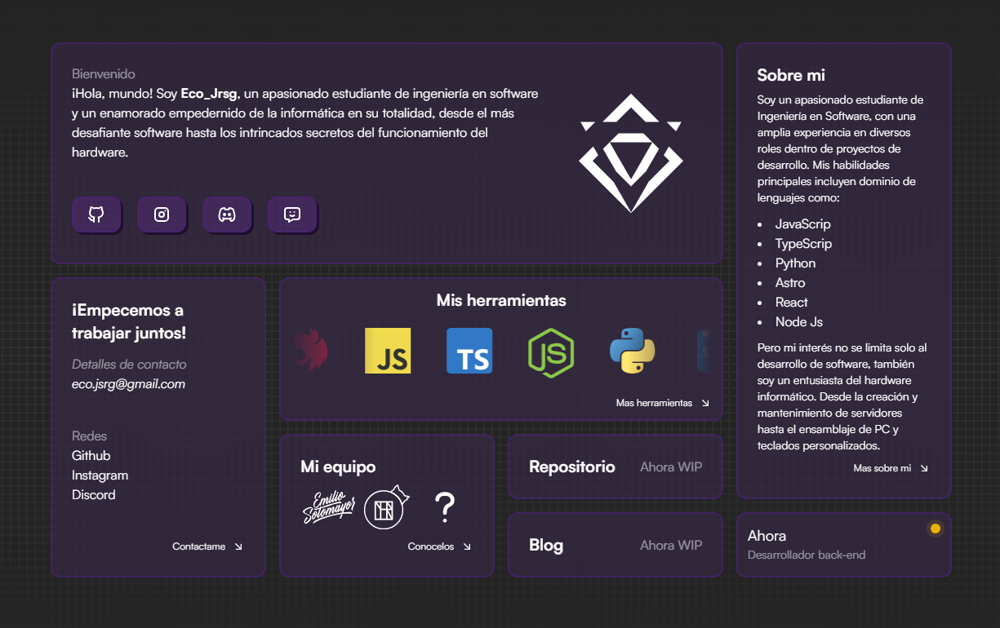

# 🌐 Eco_Page

Página personal para uso de presentación, repositorio y blog



## Características

- Todo en uno
- Responsivo
- Estructura Bento
- Repositorio
- Blog
- Página estática

## Tecnologías

- [Astro](https://astro.build)
- [React](https://es.react.dev)
- [Tailwind](https://tailwindcss.com)
- [Motion](https://motion.dev)

## Referencias

- [astro-bento-portfolio](https://github.com/Ladvace/astro-bento-portfolio.git)
- [Wooting](https://wooting.io)

## Pasos ▶️

```bash
# Clona el repositorio
$ git clone https://github.com/JonaJRSG/Eco_Page.git
```

```bash
# Entra a la carpeta del proyecto
$ cd Eco_Page
```

```bash
# Instala dependencias
$ pnpm install
or
$ npm install
```

```bash
# Empieza el proyecto en modo desarrollador
$ pnpm run dev
or
$ npm run dev
```

# Estado

En desarrollo
